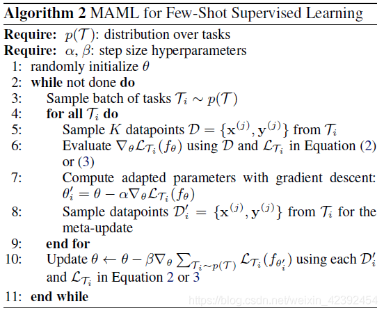
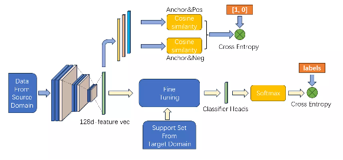
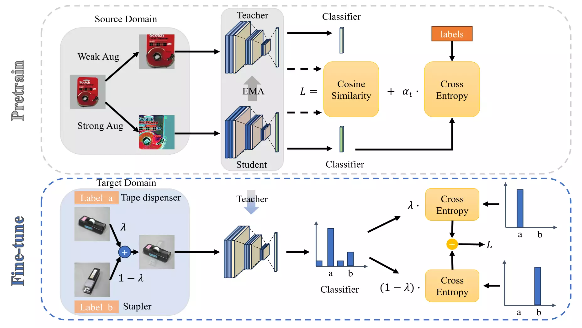
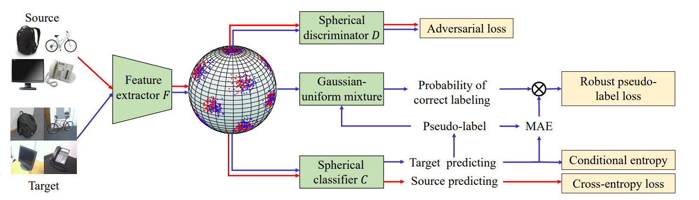

# HUST-AIA模式识别大课设
## Introduction
本仓库由华中科技大学人工智能与自动化学院5名大三本科生所作，用于保存人工智能与自动化学院于2023年下半学期开设的模式识别课设所写代码。本仓库所写代码均经过实践测试，可以将其下载下来配置好后即可运行。

本仓库主要围绕选题跨域小样本目标识别进行，小组成员均贡献出不同方向的代码，所以读者可以将代码下载下来后分别进行验证。如果本代码对你有帮助，麻烦给我们star一下以示支持！


## Data Preparation
本代码主要是在跨域小样本数据集Office31和Office-home上进行编写。

Office31数据集的包括三个域：非别是亚马逊商城(在线电商)图片，单反相机拍摄图片，网络摄像头拍摄图片，包括31个类。[[官网下载]](https://faculty.cc.gatech.edu/~judy/domainadapt/)

Office-home是域适应的一个基准数据集，包含4个不同域，每个域由65个类别组成，分别是艺术、剪贴画、产品和真实世界。它包含15500个图像，每个类平均约70个图像，一个类最多99个图像。[[官网下载]](https://www.hemanthdv.org/officeHomeDataset.html)

为了方便读者下载，我们提供[[百度网盘]](https://pan.baidu.com/s/1CkmSknfceYJQ5ls_G84pvg?pwd=PRML)的数据集下载方式

下载完成后，需要将数据集整理到data_set文件夹下，按照如下方式整理：
```
data_set
├── office-31
│   ├── amazon
|   |       └── images
|   |           ├── back_pack
|   |           |       └── frame_0001.jpg
|   |           |       └── frame_xxx.jpg
|   |           ├── xxx
|   |           |
|   |           └── trash_can
|   |                   └── frame_0001.jpg
|   |                   └── frame_xxx.jpg
|   ├── dslr
|   └── amazon
└── OfficeHome
    ├── Art
    |   ├── Alarm_Clock
    |   |       ├── 00001.jpg
    |   |       └── xxxxx.jpg`
    |   ├── xxx
    |   └── Webcam
    ├── Clipart
    ├── Product
    ├── RealWorld
    ├── ImageInfo.csv
    └── Imagelist.txt
```
## Model

本仓库共有4种模型，接下来对该5种模型进行简单介绍，详细介绍请移步每个模型的文件夹。

### MAML

MAML(Model-Agnostic Meta-Learning)是一种元学习的模型，原论文可以共通过[[论文地址]](https://arxiv.org/pdf/1703.03400.pdf)进行获取。

其主要解决的是小样本以及模型手链速度太慢两个问题，由于其考虑两个数据集的分布问题，因而其可以实现在两个任务中达到全局最优，其核心算法如下所示：



### PMF

在孪生网络训练阶段，模型从源域中提取包括锚点、正样本和负样本的一组数据，输入backbone得到三者的特征向量。之后将锚点分别与基于孪生网络的PMF模型结构如下图所示。



模型pipeline为典型的pretrain-finetune结构。P（预训练）阶段由预训练模型ResNet-50代替，并将fc层的输出维度修改为128维。这样数据经过预训练backbone后，映射成为128维特征向量。为了不破坏预训练模型已经提取出的视觉特征，将backbone其余部分的权重冻结，此后所有训练只更新fc层及后续部分的模型。

正样本、负样本计算余弦相似度，其结果拼接成一个2维向量，与参考标签进行交叉熵计算得到相似度损失，使用梯度下降。

孪生网络训练完毕后，在目标域的Support Set上进行微调。在fc层后增加一个分类器层，输出维度为31维，其核心是一个128-to-31的变换矩阵。将Support Set的所有数据通过backbone映射为128维特征向量后，以类别计算特征向量的均值，并将结果拼接成维的矩阵，作为分类器变换矩阵的初始值。分类器bias的初始值全部设置为0。Support Set的数据经过整个网络后得到31维向量，与真实标签（31维one-hot向量）进行交叉熵计算得到分类损失，使用梯度下降法更新网络权重。

### Self-distillation and MixUp

基于自蒸馏和混合的有监督域自适应模型结构如下图所示。模型训练分为两阶段：源域上预训练和目标域上微调。



对源域中图片，分别进行弱增强（随机裁剪，随机翻转）和强增强（与SimCLR相似，包括随机颜色变化，高斯模糊等）。分别将弱增强后图片送入Teacher模型，强增强后图片送入Student模型得到中间向量和结果向量，计算Student模型分类损失和Teacher与Student模型对齐损失，通过可变参数调节两个损失所占比重，以更好地训练模型。通过梯度更新Student模型，指数移动平均更新Teacher模型。

对目标域中有标签图片，使用预训练阶段的Teacher模型，随机抽取两张图按符合Beta分布的参数进行融合，将结果向量分别与两张图的标签计算交叉熵损失，按比例融合损失更新模型。

### RSDA

